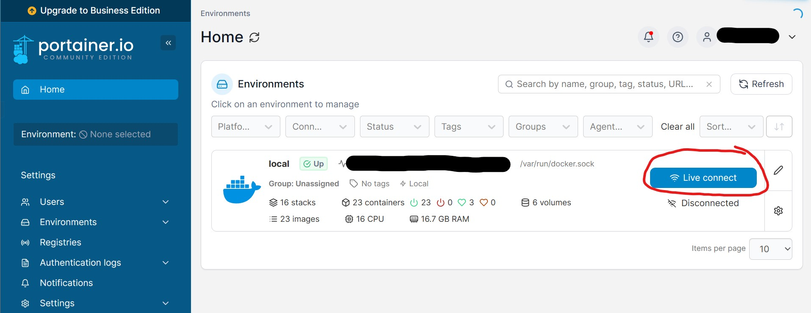
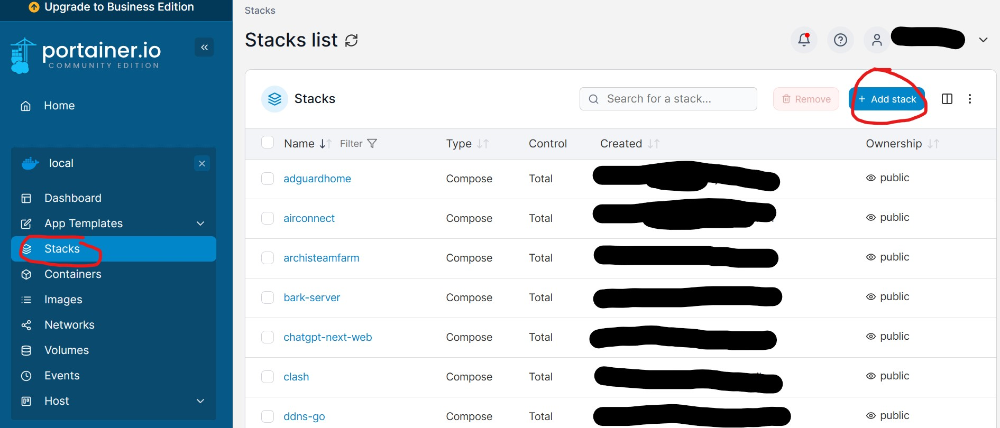
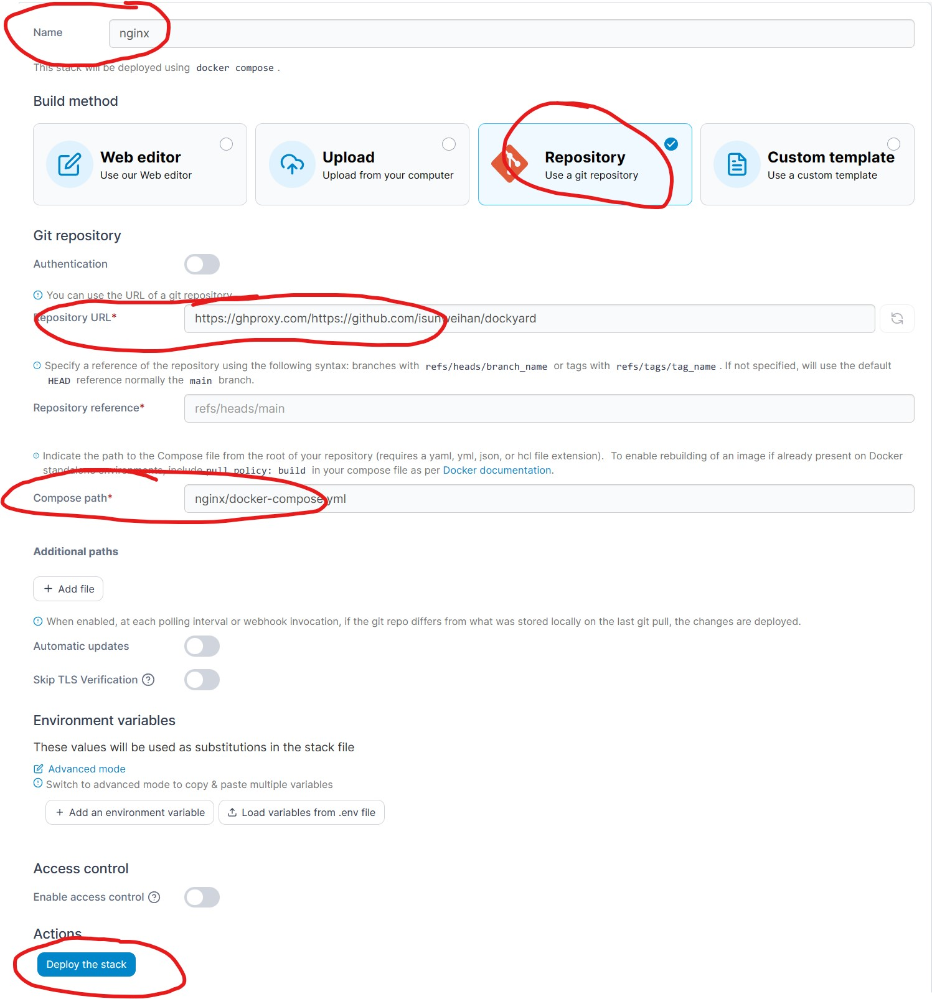

# dockyard

## 1. 项目介绍

可复用、可移植、便捷的 Docker Compose 配置文件合集。

## 2. 内容简介

已包含如下 docker 项目：

+ [adguardhome](https://github.com/AdguardTeam/AdGuardHome)：免费、开源、强大的网络广告和跟踪器阻止 DNS 服务器。
+ [airconnect](https://github.com/1activegeek/docker-airconnect)：使局域网中的智能音箱支持 AirPlay 和 DLNA；
+ [archisteamfarm](https://github.com/JustArchiNET/ArchiSteamFarm)：Steam 自动挂卡工具；
+ [bark-server](https://github.com/Finb/bark-server)：向手机发送自定义消息推送；
+ [chatgpt-next-web](https://github.com/Yidadaa/ChatGPT-Next-Web)：一键拥有你自己的跨平台 ChatGPT 应用；
+ [clash](https://github.com/Dreamacro/clash)：全家科学上网解决方案；
+ [ddns-go](https://github.com/jeessy2/ddns-go)：简单好用的 DDNS，自动更新域名解析到公网 IP；
+ [dst-server](https://github.com/Jamesits/docker-dst-server)：游戏饥荒联机版（Don't Starve Together）服务端；
+ [flare](https://github.com/soulteary/docker-flare)：轻量、快速、美观的个人导航页面，适用于 HomeLab 或其他注重私密的场景；
+ [jellyfin](https://github.com/jellyfin/jellyfin)：开源媒体系统；
+ [memos](https://github.com/usememos/memos)：隐私至上的轻量级笔记服务，轻松捕捉和分享您的伟大想法；
+ [minio](https://github.com/minio/minio)：高性能对象存储系统；
+ [mt-photos](https://mtmt.tech/)：一款为Nas玩家准备的照片管理系统；
+ [navidrome](https://github.com/navidrome/navidrome)：现代化的音乐流媒体服务器；
+ [nextcloud](https://github.com/nextcloud/docker)：私有云存储系统，为您的所有数据提供安全保护，根据您的条件，从任何设备访问和共享您的文件、日历、联系人、邮件等；
+ [nginx](https://github.com/nginx/nginx)：一款高性能的开源Web服务器和反向代理服务器，具有占用资源少、并发处理能力强、稳定可靠等特点；
+ [nginx-proxy-manager](https://github.com/NginxProxyManager/nginx-proxy-manager)：用于管理 Nginx 代理主机的 Docker 容器，具有简单，强大的界面；
+ [photoprism](https://github.com/photoprism/photoprism)：一款用于去中心化网络的AI驱动的照片应用程序。它利用最新技术自动标记和查找图片，而不会妨碍您。 您可以在家中、私人服务器或云中运行它。
+ [pms-docker](https://github.com/plexinc/pms-docker)：借助我们易于安装的 Plex 媒体服务器软件和您的 Plex 应用程序，您可以在所有喜爱的手机、平板电脑、流媒体设备、游戏机和智能电视上使用，您可以随时随地将视频、音乐和照片集流式传输到任何设备。
+ [qbittorrent](https://github.com/SuperNG6/docker-qbittorrent)：Docker qBittorrent 中国优化版。
+ [qiandao](https://github.com/qd-today/qd)：一个HTTP请求定时任务自动执行框架。
+ [speedtest](https://github.com/librespeed/speedtest)：适用于 HTML5 等的自托管速度测试。易于设置，示例，可配置，移动友好。支持 PHP、节点、多个服务器等。
+ [ttrss](https://github.com/HenryQW/Awesome-TTRSS)：一个「容器化」的 Tiny Tiny RSS（一款基于 PHP 的免费开源 RSS 聚合阅读器）的一站式解决方案，通过提供简易的部署方式以及一些额外插件，以提升用户体验。
+ [virtual-dsm](https://github.com/kroese/virtual-dsm)：在 Docker 容器中虚拟化群晖 DSM。
+ [vocechat-server](https://github.com/Privoce/vocechat-server-rust)：一款支持独立部署的个人云社交媒体聊天服务。
+ [watchtower](https://github.com/containrrr/watchtower)：自动检查 Docker 容器基础镜像版本更新。

## 3. 使用方法

### 3.1 使用 Portainer 部署 Docker 容器（推荐）

#### 3.1.1 部署 Portainer 容器

1. 选择一个合适的目录用于存放 Docker 容器的配置文件，避免重新部署镜像后配置丢失。
2. 创建目录用于存放 Portainer 容器配置文件。
3. 部署 Portainer 容器，推荐使用命令部署，参考命令如下，其中 ${PORTAINER_CONFIG_FOLDER} 是第 2 步中创建的目录，${PORTAINER_PORT} 是用户访问 Portainer 的端口：

```
sudo docker run -d --name=portainer-ce \
-p ${PORTAINER_PORT}:9000 \
-v /var/run/docker.sock:/var/run/docker.sock \
-v ${PORTAINER_CONFIG_FOLDER}:/data \
--restart=always \
portainer/portainer-ce
```

4. 部署成功后访问 ${NAS_IP}:${PORTAINER_PORT}，初始化账号、密码后进入 Portainer 界面。

#### 3.1.2 使用 Portainer Stack 部署 Docker Compose

1. 在 Docker 容器配置文件目录下创建文件夹，见对应 docker-compose.yml 中的 volumes 配置项；

2. 进入 Portainer 界面，connect 到 local 环境。



3. 在左侧菜单选择 Stacks 功能后，点击 Add stack 按钮添加 Stack 配置。



4. 进入新建页面后，依次填下如下参数，以 nginx 为例：

```
Name：填写要部署的项目的名称，如 nginx；
Build method：选择 Repository；
Repository URL：填写 Git 仓库地址 URL 地址，如下：
    - Github 直连地址：https://github.com/isunweihan/dockyard
    - 国内镜像加速地址：https://ghproxy.com/https://github.com/isunweihan/dockyard
Compose path：填写仓库中 docker-compose.yml 文件的相对路径，如 nginx/docker-compose.yml。
```

如图：



5. 进阶配置，在 Stack 部署中使用环境变量：部分不能公开的数据，如各种密钥、密码等，或是与环境有关的配置，需要使用环境变量配置，如 chatgpt-next-web/docker-compose.yml 中 存在 ${...} 格式的环境变量，在新建 Stack 界面 Environment variables 部分添加对应环境变量的 name 和 value 即可。（如果 docker-compose.yml 需要环境变量，但是这里没有添加，会部署失败）

6. 填写完信息点击 Deploy the stack 部署。
